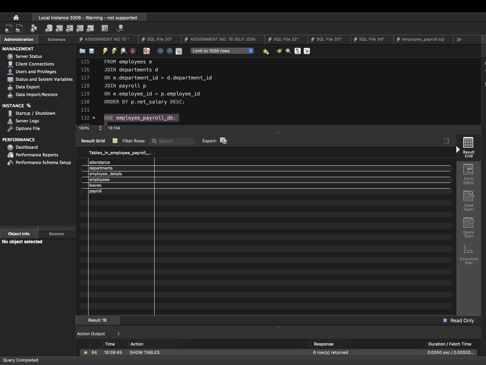

# Employee Payroll Management System

## Project Overview

The Employee Payroll Management System is a relational database project developed using MySQL.

This project manages employee information, departments, attendance, leaves, and payroll details.

## Objectives

- Manage employee information
- Manage department details
- Track employee attendance
- Manage employee leaves
- Store payroll information
- Generate employee and salary reports

## Technologies Used

- MySQL
- MySQL Workbench
- SQL

## Database Tables

1. Departments
2. Employees
3. Attendance
4. Leaves
5. Payroll

## SQL Concepts Used

- DDL
- DML
- SELECT
- WHERE
- ORDER BY
- LIKE
- BETWEEN
- Aggregate Functions
- GROUP BY
- HAVING
- INNER JOIN
- Subqueries
- CASE Statement
- Views
- Stored Procedures
- Transactions
- Indexes
- Primary Key
- Foreign Key

## Key Reports

- Employee details
- Department-wise employee count
- Department-wise average salary
- Highest salary
- Second highest salary
- Employees earning above average salary
- Attendance report
- Leave report
- Complete payroll report
## 📸 Project Screenshots

### Database Tables

## How to Run

1. Open MySQL Workbench.
2. Run `employee_payroll.sql`.
3. Open `queries.sql`.
4. Execute the required SQL queries.
5. View the results in MySQL Workbench.

## Author

Rohit Vijay Kisave

B.Tech Computer Science  
MIT ADT University, Pune
